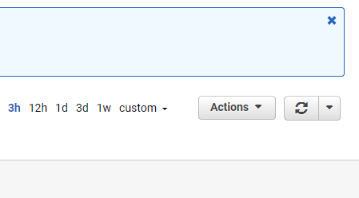

# Chrome Extension: AWS QuickSearch

Quickly switch services & regions in AWS.

## Usage / Features

### Keyboard Shortcuts

<kbd>shift</kbd>, <kbd>shift</kbd> (in quick succession): Toggles service selector.

<kbd>shift</kbd> + <kbd>R</kbd>: Toggles region selector.

### Region Searching

* Adds a search box to filter region selection. Start typing as soon as the region list is open!
* Use arrow keys to navigate between regions, and the filter box. Loops from top to bottom, and bottom to top.

## Feature Support

* Shortcuts are supported in both old and new dashboard versions.
* Region filtering / searching is supported only in the new dashboard version.

## Bugs / Issues / Feature Requests

Please use the GitHub issue tracker to report any feedback. 
